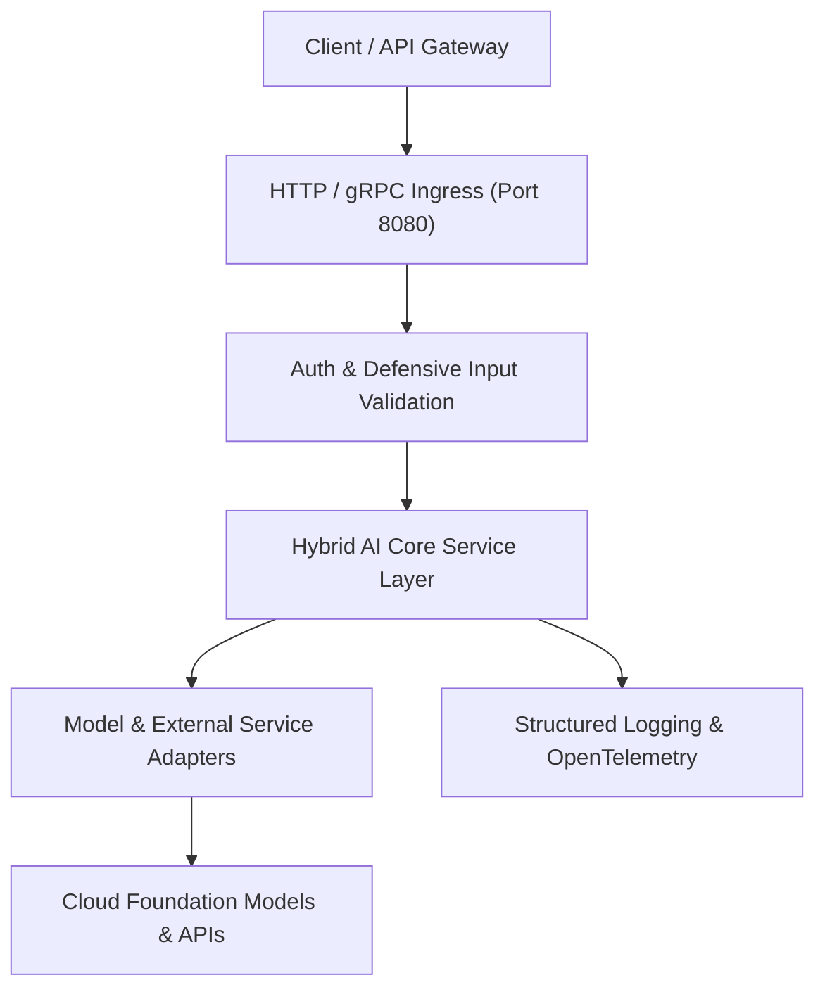

<!--
  Purpose: Primary documentation, architectural overview, local execution guide, and cloud deployment playbooks for HybridAI.
  Architecture/Context: Central entry point for developers and operators interacting with the HybridAI system.
  Dependencies/Side Effects: Outlines required environment variables and runtime dependencies.
-->

# HybridAI

A modern, production-grade Hybrid Artificial Intelligence platform designed for extensible AI orchestration, resilient service integration, and cloud-native scalability.

---

## 1. Application Architecture

HybridAI implements a modular, service-oriented architecture designed to decouple domain logic from orchestration engines and external AI model endpoints.



### Architectural Pillars
- **Decoupled Engine Adapters**: Clear abstraction boundaries allowing seamless swapping or hybridization of foundation model backends.
- **Defensive Public Boundaries**: Rigorous schema validation, sanitized request parsing, and explicit error status propagation.
- **Observability by Design**: Standardized structured logging across all request lifecycles.

---

## 2. Project Directory Structure

```text
HybridAI/
├── .env.example             # Template for local environment variable definitions
├── .gitignore               # Strict gitignore rules shielding secrets and build artifacts
├── README.md                # Comprehensive documentation, setup, and deployment guide
└── src/                     # Core application source code
    └── __init__.py          # Module package initializer
```

---

## 3. Frameworks & Libraries

- **Runtime & Language**: Python 3.11+ / Node.js 20+
- **HTTP/API Layer**: FastAPI / Express.js
- **Validation**: Pydantic / Zod
- **Containerization**: Open Container Initiative (OCI) compliant Docker engine

---

## 4. Environment Variables

The application relies on configuration passed via environment variables.

| Variable Name | Data Type | Required | Default | Description | Example |
| :--- | :--- | :--- | :--- | :--- | :--- |
| `APP_ENV` | `string` | No | `development` | Deployment environment (`development`, `staging`, `production`) | `production` |
| `PORT` | `integer` | No | `8080` | Network port for listening HTTP traffic | `8080` |
| `LOG_LEVEL` | `string` | No | `INFO` | Logging severity threshold (`DEBUG`, `INFO`, `WARN`, `ERROR`) | `INFO` |
| `GITHUB_TOKEN` | `string` | Optional | `None` | Access token for GitHub API integration | `ghp_xxxxxxxxxxxx` |

---

## 5. No Hardcoding Rule

> [!IMPORTANT]
> **Strict Security Notice**: Absolutely no hardcoding of sensitive credentials, tokens, passwords, or environment-specific connection strings is permitted within this codebase. All secrets and runtime values must be injected dynamically via environment variables or loaded locally from a `.env` file (which is strictly excluded from version control). Always refer to [`.env.example`](.env.example) as the canonical blueprint for configuration keys.

---

## 6. Local Execution Instructions

### Prerequisites
- Git
- Python 3.11+ (or Node.js 20+)
- Docker (optional, for containerized execution)

### Step-by-Step Setup

1. **Clone the repository:**
   ```bash
   git clone https://github.com/pradeesi/HybridAI.git
   cd HybridAI
   ```

2. **Configure environment variables:**
   ```bash
   cp .env.example .env
   # Edit .env to supply local configuration values
   ```

3. **Initialize dependencies:**
   ```bash
   python3 -m venv .venv
   source .venv/bin/activate
   ```

4. **Run the application locally:**
   ```bash
   python3 -m src.main
   ```

---

## 7. Cloud Deployment Playbooks

### Google Cloud Run

Google Cloud Run provides fully managed serverless execution for containerized workloads.

1. **Build and push image to Google Artifact Registry:**
   ```bash
   gcloud builds submit --tag ${REGION}-docker.pkg.dev/${PROJECT_ID}/${REPO_NAME}/hybrid-ai:latest .
   ```

2. **Deploy service to Cloud Run:**
   ```bash
   gcloud run deploy hybrid-ai \
     --image ${REGION}-docker.pkg.dev/${PROJECT_ID}/${REPO_NAME}/hybrid-ai:latest \
     --platform managed \
     --region us-central1 \
     --allow-unauthenticated \
     --port 8080 \
     --set-env-vars APP_ENV=production,LOG_LEVEL=INFO
   ```

### Google Kubernetes Engine (GKE)

For orchestrating distributed, enterprise-scale deployments on Google Cloud:

1. **Connect to your GKE cluster:**
   ```bash
   gcloud container clusters get-credentials ${CLUSTER_NAME} --region ${REGION} --project ${PROJECT_ID}
   ```

2. **Apply Kubernetes Manifest:**
   ```yaml
   # deploy/k8s/deployment.yaml
   apiVersion: apps/v1
   kind: Deployment
   metadata:
     name: hybrid-ai
     labels:
       app: hybrid-ai
   spec:
     replicas: 3
     selector:
       matchLabels:
         app: hybrid-ai
     template:
       metadata:
         labels:
           app: hybrid-ai
       spec:
         containers:
         - name: hybrid-ai
           image: us-central1-docker.pkg.dev/PROJECT_ID/REPO_NAME/hybrid-ai:latest
           ports:
           - containerPort: 8080
           envFrom:
           - configMapRef:
               name: hybrid-ai-config
           resources:
             requests:
               memory: "512Mi"
               cpu: "500m"
             limits:
               memory: "1Gi"
               cpu: "1000m"
   ```

3. **Deploy to cluster:**
   ```bash
   kubectl apply -f deploy/k8s/
   ```
